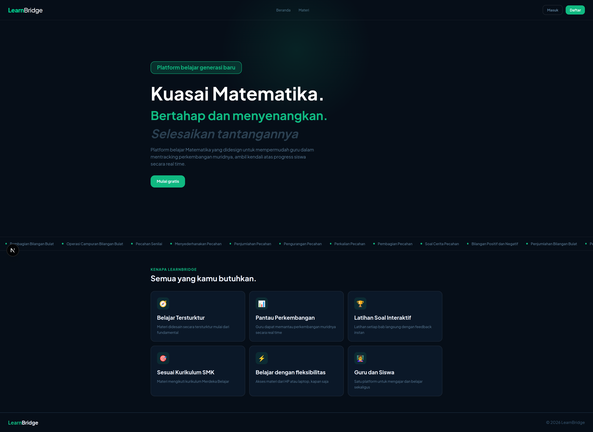
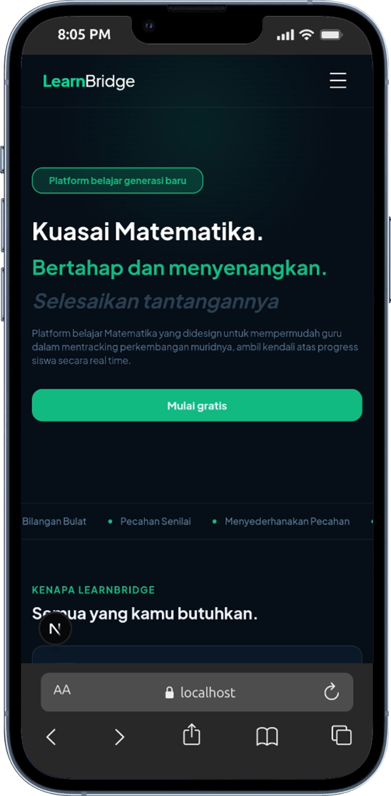
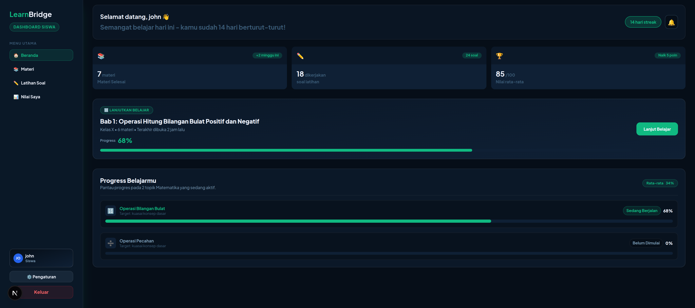
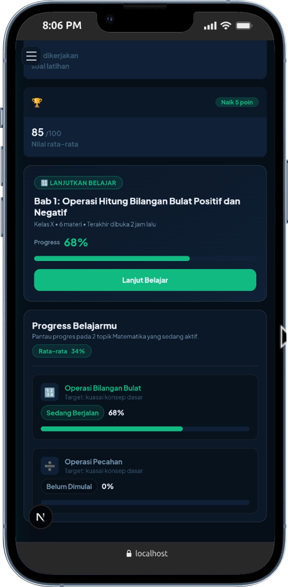
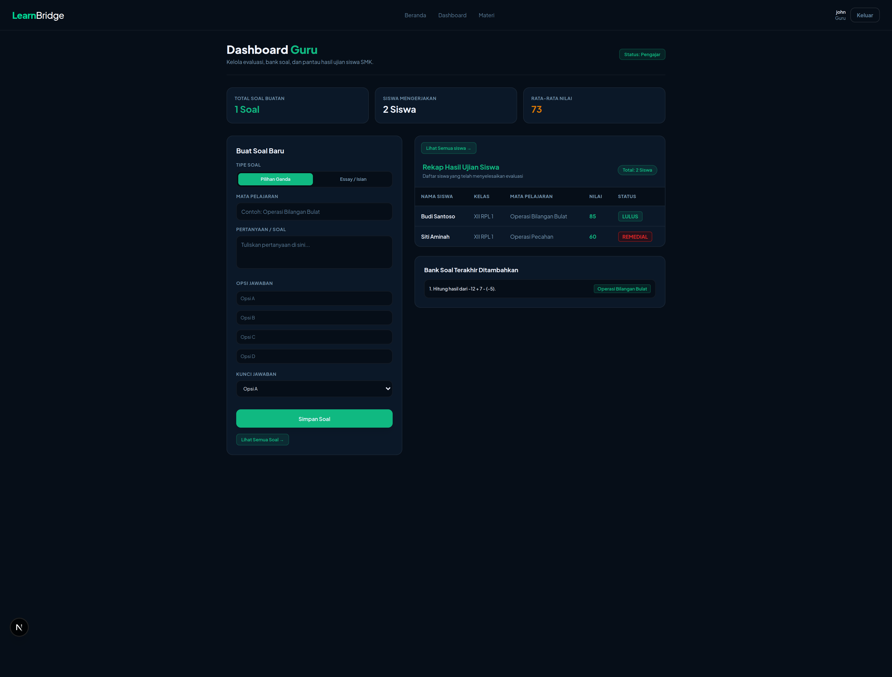
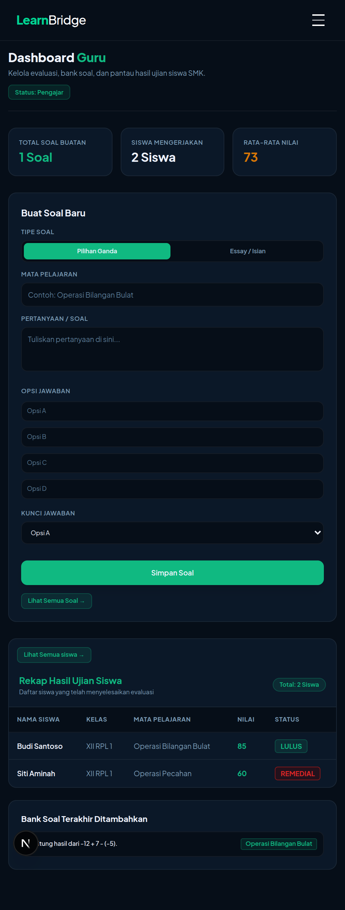

# Crack Frontend

Platform pembelajaran online matematika yang dibangun dengan Next.js untuk mendukung proses belajar mengajar matematika antara guru dan siswa.

## Fitur Utama

- **Dashboard Guru**: Mengelola soal, melihat hasil siswa, dan mengelola materi pembelajaran
- **Dashboard Siswa**: Mengakses materi, mengerjakan latihan soal, dan melihat nilai
- **Autentikasi**: Sistem login dan registrasi untuk guru dan siswa
- **Manajemen Nilai**: Tracking hasil dan performa siswa

## Teknologi

- **Frontend**: Next.js 16, React 19
- **Styling**: Tailwind CSS 4
- **Form**: React Hook Form
- **Runtime**: Node.js

##  Struktur Folder Project

```text
src/
├── app/
│   ├── components/
│   │   ├── layout/          # Navbar & Footer
│   │   └── ui/              # Komponen UI Reusable (Card, Marquee)
│   ├── context/             # AuthContext (Sesi & Role User)
│   ├── dashboard/           # Modul Dashboard Utama
│   │   ├── greeting.jsx     # Komponen Ucapan Dinamis
│   │   ├── guru/            # Fitur & Halaman Pengajar
│   │   │   ├── components/  # FormTambahSoal, TabelHasilSiswa
│   │   │   ├── hasil/       # Rekap Hasil Siswa
│   │   │   ├── kelola-soal/ # Bank Soal & Editing
│   │   │   ├── kuis/        # Manajemen Kuis Guru
│   │   │   └── materi/      # Publikasi Materi
│   │   └── siswa/           # Fitur & Halaman Siswa
│   │       ├── components/  # ContinueCard, ProgressCard, StatCards
│   │       ├── kuis/        # Pengerjaan Kuis Dynamic (`/kuis/[id]`)
│   │       ├── latihan-soal/# Daftar Kuis/Latihan Soal
│   │       └── materi/      # Modul Baca Materi (`/materi/[id]`)
│   ├── login/               # Halaman Authentikasi Login
│   ├── register/            # Halaman Registrasi Akun
│   ├── nilai/               # Halaman Rekap Nilai Siswa
│   ├── pengaturan/          # Halaman Pengaturan Akun
│   ├── layout.jsx           # Root Layout Application
│   ├── page.jsx             # Landing / Hero Page
│   └── globals.css          # Global Styling & Theme
└── lib/
    └── api.js               # Central API Client Fetcher

## Memulai

1. **Install dependencies**

   ```bash
   npm install
   ```

2. **Jalankan development server**

   ```bash
   npm run dev
   ```

3. Buka [http://localhost:3000](http://localhost:3000) di browser

## Perintah Tersedia

- `npm run dev` - Jalankan development server
- `npm run build` - Build untuk production
- `npm start` - Jalankan production server
- `npm run lint` - Jalankan linter

## Screenshot


### Hero Page
<p align="left">
    
    
</p>

### Dashboard Siswa
<p align="left">
    
    
</p>

### Dashboard Guru
<p align="left">
    
    
</p>